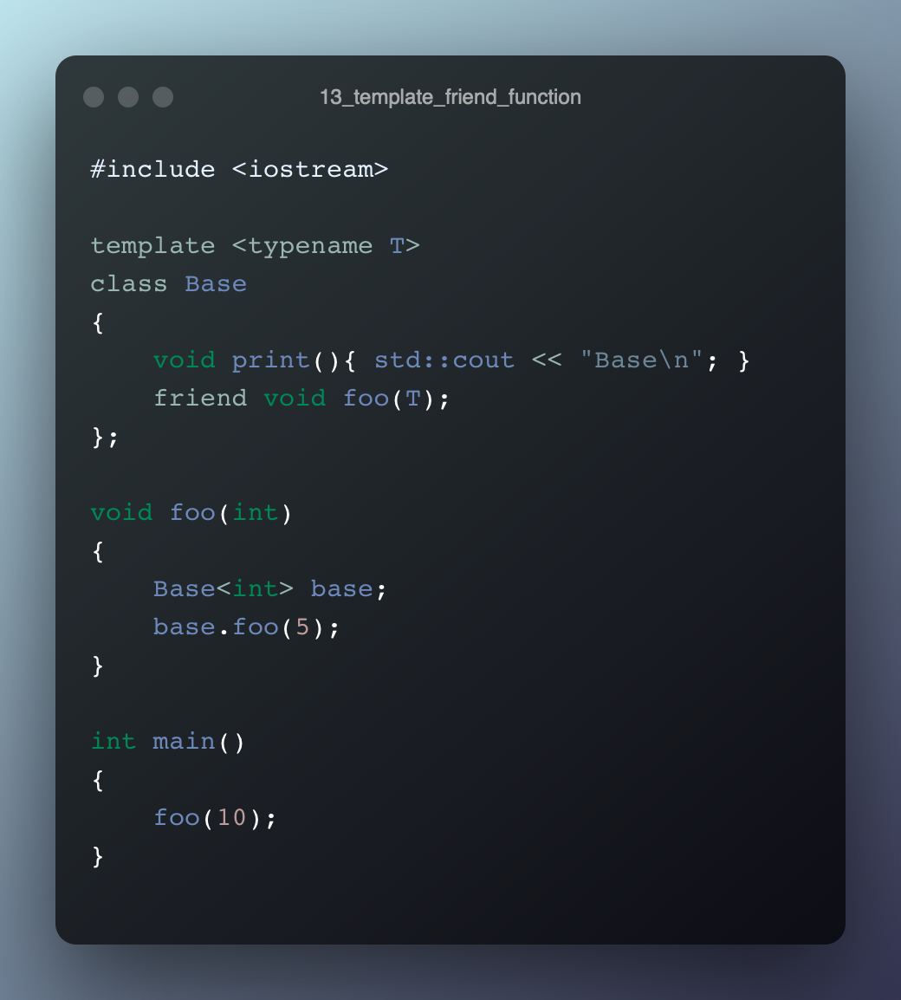
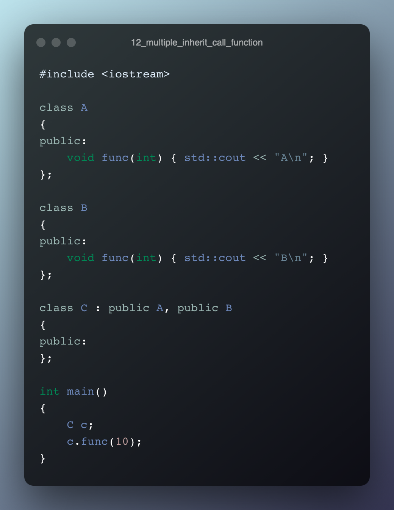
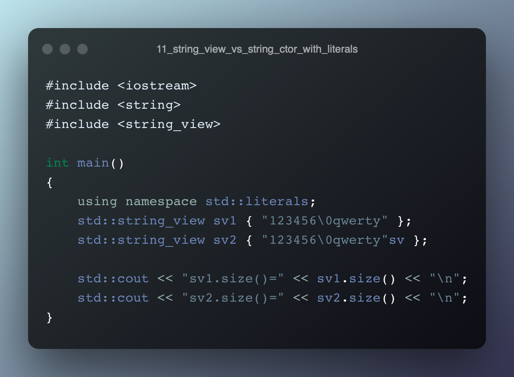
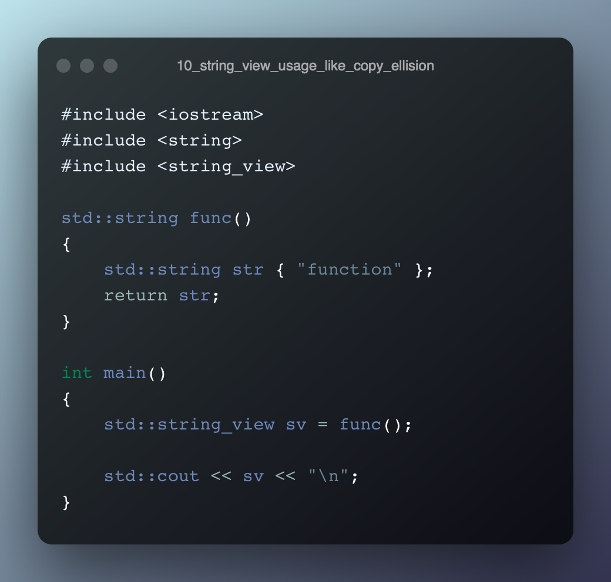
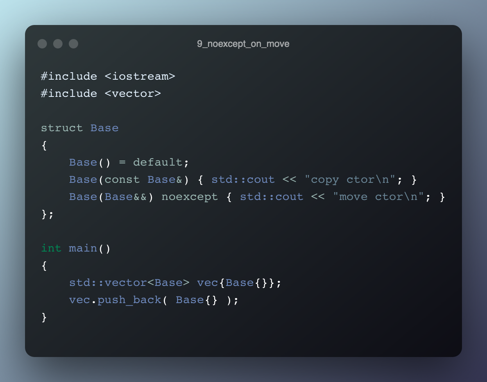
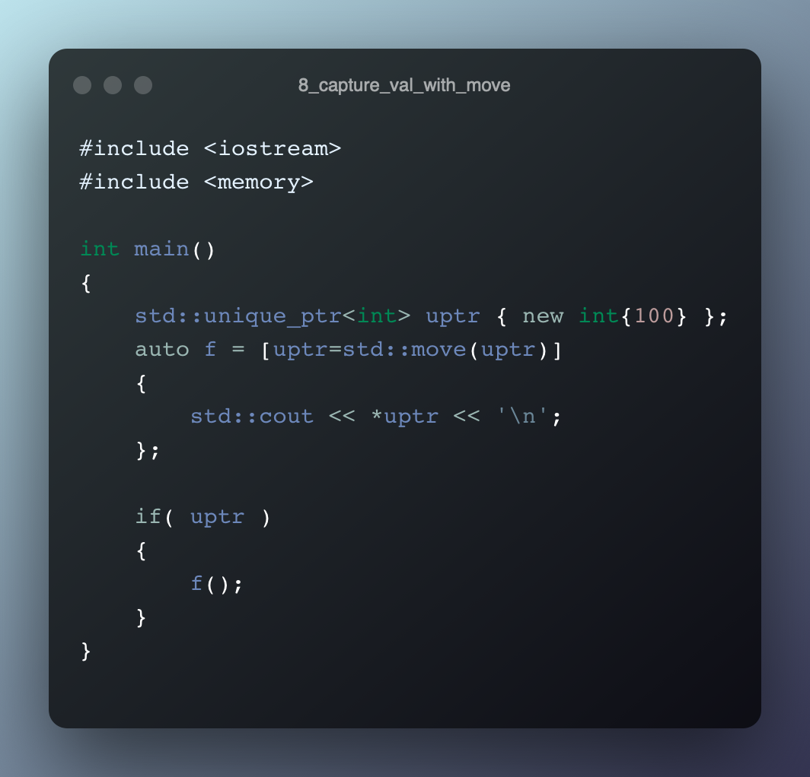
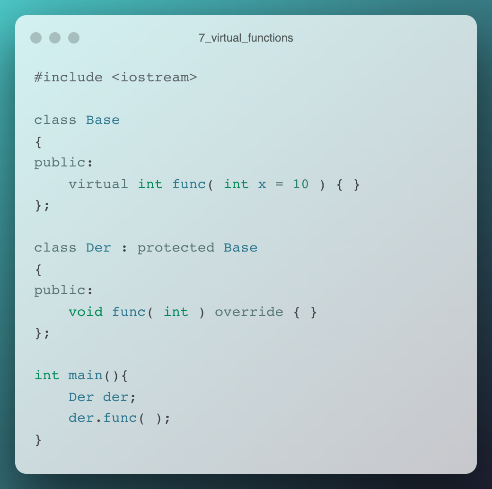
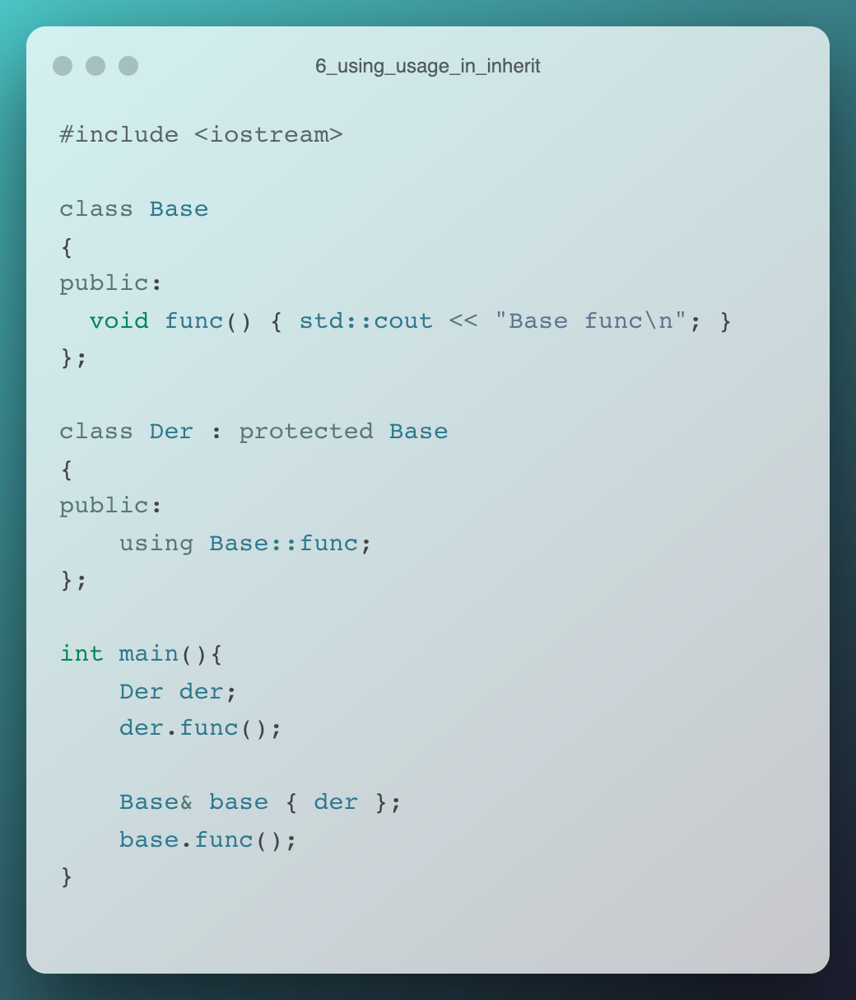
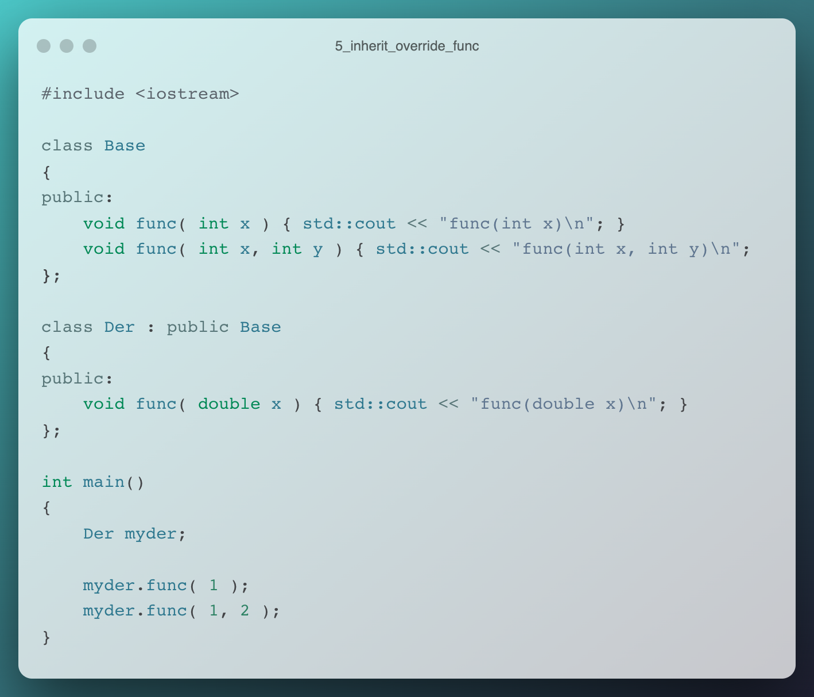

# cpp exercises

## **Q13**

**[play with code](https://godbolt.org/z/rsz336ons)**

---
## **Q12**

**[play with code](https://godbolt.org/z/arhbczPdT)**

---
## **Q11**

**[play with code](https://godbolt.org/z/hfj1PPaTn)**

---
## **Q10**

**[play with code](https://godbolt.org/z/Tabnh768r)**

---
## **Q9**

**[play with code](https://godbolt.org/z/TsGcev7Ez)**

---
## **Q8**

**[play with code](https://godbolt.org/z/xvdvq4nTx)**

---
## **Q7**

**[play with code](https://godbolt.org/z/zhGqnY9Go)**

---
## **Q6**

**[play with code](https://godbolt.org/z/hdahrxsa6)**

---
## **Q5**

**[play with code](https://godbolt.org/z/YjadYeenh)**

---
## **Q4**

**[play with code](https://godbolt.org/z/a63qK1zq6)**

---
## **Q3**

**[play with code](https://godbolt.org/z/svfKP1v6M)**

---
## **Q2**

**[play with code](https://godbolt.org/z/ofs8d4noa)**

---
## **Q1**

**[play with code](https://godbolt.org/z/MvY1f7576)**

---