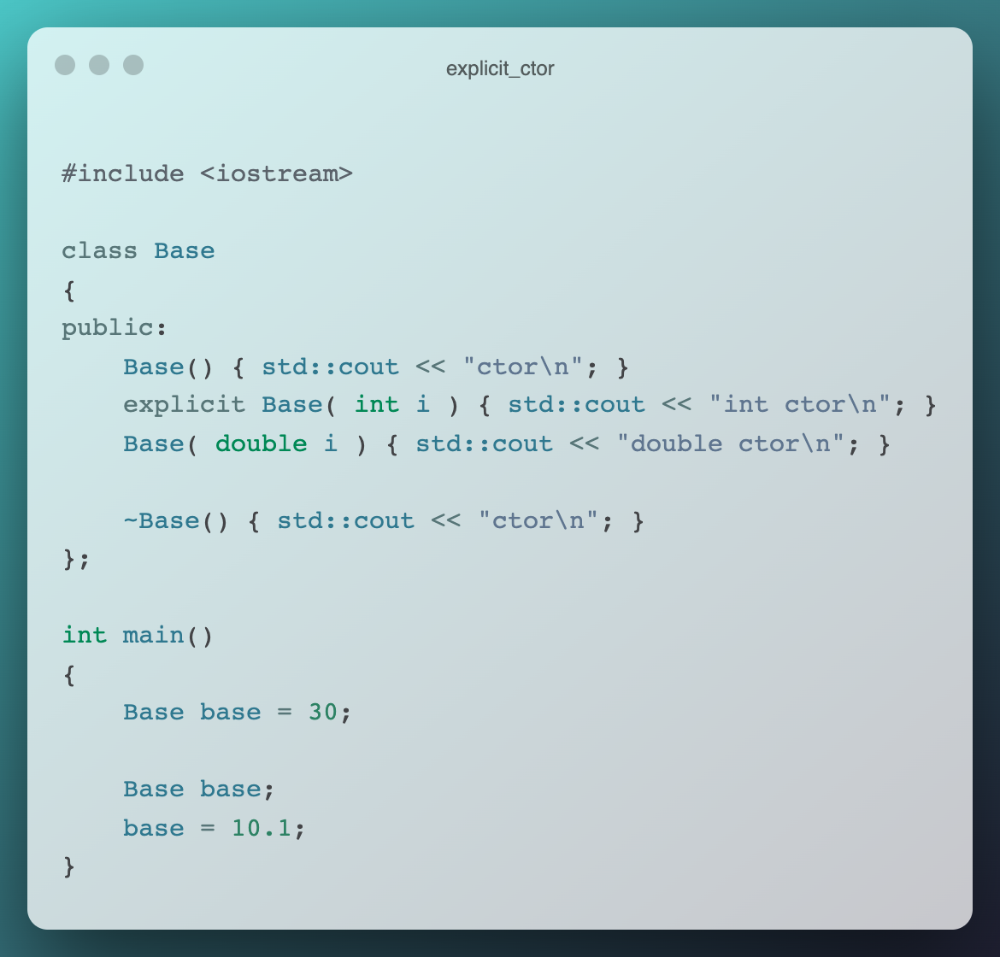
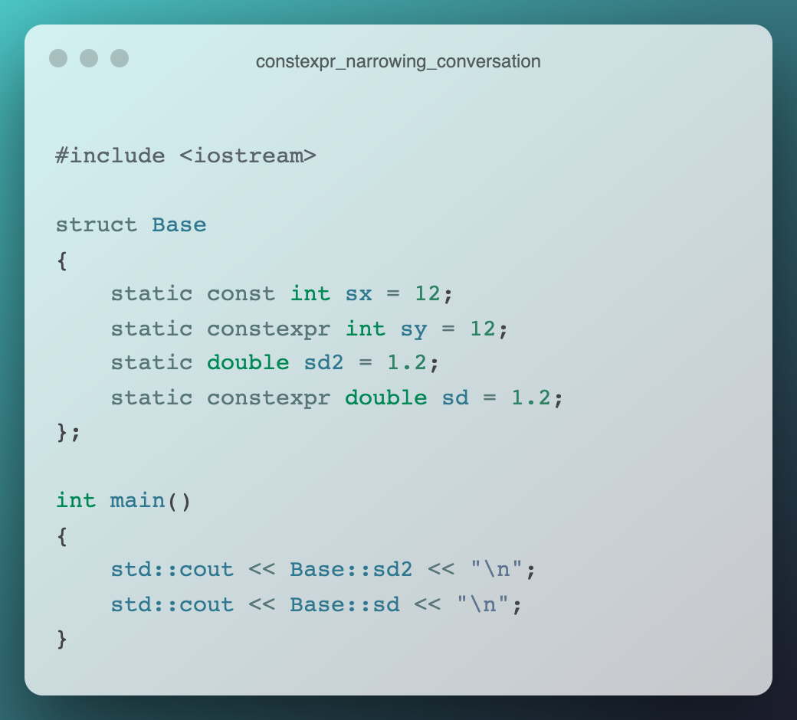
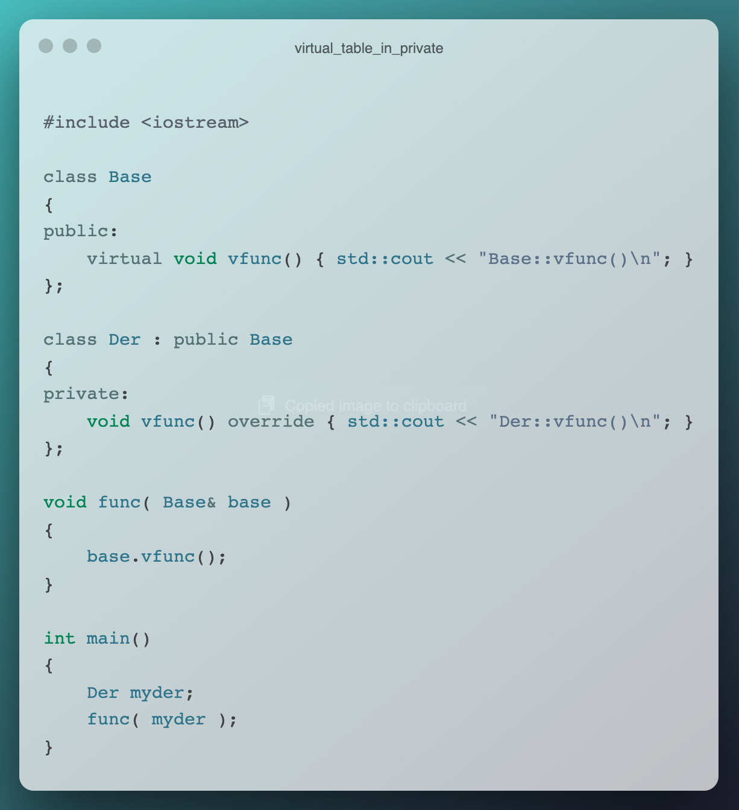
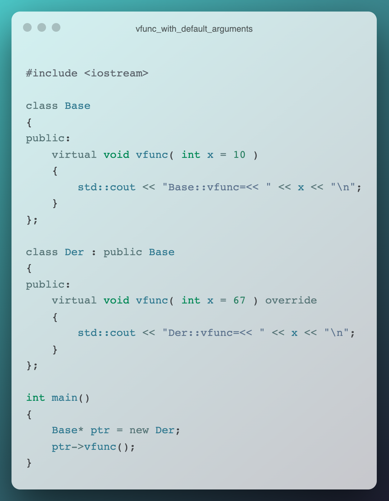

# cpp exercises

## **Q1**

**[play with code](https://godbolt.org/z/MvY1f7576)**

---
## **Q2**

**[play with code](https://godbolt.org/z/ofs8d4noa)**

---
## **Q3**

**[play with code](https://godbolt.org/z/svfKP1v6M)**

---
## **Q4**

**[play with code](https://godbolt.org/z/a63qK1zq6)**

---
